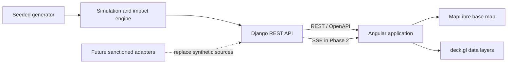

# System Architecture

## Context

The Network Digital Twin is independent from TMFORCE and other visualization projects. It uses synthetic data until sanctioned integration is approved. TMFORCE remains responsible for workforce operations; this system provides spatial context and scenario analysis.

## Logical view

## Boundaries

- The frontend consumes documented API contracts and does not depend on a particular data source.
- Django owns validation, authorization boundaries, persistence, and transport adapters.
- The simulation package owns deterministic topology generation, event scheduling, and impact calculation.
- MapLibre supplies the basemap; framework-neutral deck.gl packages render network layers.
- Real operational and customer data is explicitly excluded from the foundation and demo phases.

## Initial deployment shape

Phase 0 uses separate local frontend and backend processes. SQLite is acceptable for local development. A production database and deployment topology are deferred until the project is approved for integration work.
